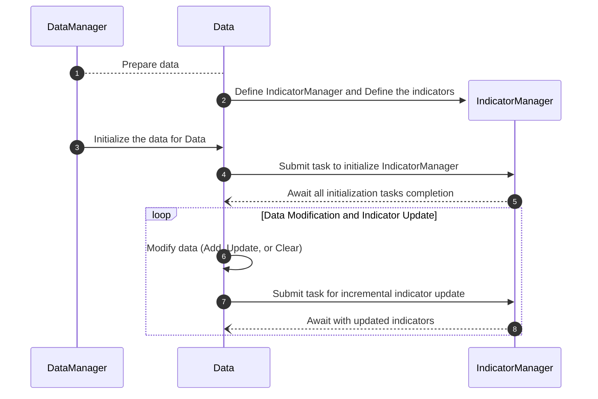

# 使用指南 

欢迎来到 **ΣTA** 使用指南！本指南将详细介绍 **ΣTA** 的核心功能及其使用方法，帮助您高效地管理数据与指标，适配多种实时交易与量化分析场景。

## 功能概览 

**ΣTA** 是一个高性能的数据与指标管理框架，专为金融量化领域设计，提供以下核心功能：

- **指标管理**：通过 `IndicatorManager` 动态管理金融指标，支持指标的添加、删除及复杂的多级依赖关系，确保计算逻辑的高度可扩展性和灵活性。
- **数据管理**：借助 `Indicator` 实现的高性能子类，对指标数据进行高效存储与管理，支持大规模数据的增量更新与优化访问。
- **增量计算**：实时响应数据变动，自动触发相关指标的增量计算，确保结果的高准确性与低延迟。
- **任务调度**：基于线程池的并行计算框架，有效调度多个指标的计算任务，提升系统整体性能与处理效率。
- **异步支持**：全面适配高并发场景，通过异步机制满足实时交易和动态计算需求，保障系统的高效稳定运行。

!!! note "适用场景"
	 **ΣTA** 适用于量化回测、实时交易、多指标依赖分析等高性能场景。


## 指标管理

**描述**：指标管理模块通过 `IndicatorManager` 实现，负责统一管理所有指标的生命周期，包括添加、删除、更新和依赖管理。支持多种金融指标的动态创建与实时更新，适用于复杂的多指标依赖场景。

#### 功能说明

- **动态添加指标**：支持直接或基于依赖关系的指标动态注册。
- **删除指标**：从管理器中移除不再需要的指标，释放资源。
- **依赖管理**：支持多级依赖，通过依赖指标的更新自动触发关联指标的重新计算。
- **状态查询**：实时获取所有指标的状态，包括当前数据量、依赖关系和初始化状态。

#### 示例代码

## 数据管理

**描述**：数据管理模块通过 `Indicator` 实现的高性能子类设计，用于管理 OHLCV 数据的存储、更新和访问。它结合了 `Indicator` 的灵活性与高效性，支持实时计算与增量更新，专为高频金融数据的动态管理而优化。

#### 功能说明

- **高性能存储**：基于 `Indicator` 子类的 NumPy 数据结构，提供快速的存取和计算能力。
- **灵活的数据操作**：支持数据的初始化、增量更新、删除与清空，满足不同场景需求。
- **实时响应**：通过与 `IndicatorManager` 的联动，数据变更时自动触发相关指标的计算更新。
- **线程安全**：通过内置锁机制，确保多线程环境下的数据操作安全。
- **高扩展性**：用户可基于 `Indicator` 设计自己的数据管理逻辑，满足特定业务场景。

#### 示例代码

## 增量计算

**描述**：增量计算模块通过指标与数据的联动实现，数据发生变化时，自动触发相关指标的增量更新，适用于实时交易与动态分析场景。

#### 功能说明

- **自动触发**：数据更新、添加、删除时，自动触发关联指标的重新计算。
- **依赖传播**：支持多指标间的依赖关系，确保更新顺序的正确性。
- **高效计算**：仅计算受影响的部分数据，提升性能。

#### 示例代码

## 任务调度

**描述**：任务调度模块通过线程池管理所有指标计算任务，确保多任务并行执行的高效性。

#### 功能说明

- **线程池支持**：基于共享线程池调度任务，实现任务的并行化。
- **自动任务管理**：数据操作后，自动提交计算任务到线程池。
- **同步与异步等待**：支持同步和异步方式等待任务完成。

#### 示例代码

## 异步支持

**描述**：异步支持模块提供非阻塞的任务执行与等待，适配高并发场景，确保系统实时响应。

#### 功能说明

- **异步计算**：支持通过线程池执行的异步任务提交与执行。
- **异步等待**：提供异步方法 `synchronize_async`，实现指标更新任务的非阻塞等待。
- **事件回调**：通过异步回调实时响应数据变化与计算任务完成。

#### 示例代码





??? note "详细序列图展示"
    ```mermaid
    sequenceDiagram
      autonumber
      DataManager->>DataManager: Load OHLCV Data
      DataManager-->Data: Prepare data
      create participant IndicatorManager
      Data->>IndicatorManager: Define IndicatorManager
      create participant Indicator
      IndicatorManager->>Indicator: Define the indicators
      DataManager->>Data: Initialize the data for Data
      Data->>GlobalThreadPool: Submit task to initialize IndicatorManager
      GlobalThreadPool-->>IndicatorManager: Submit initialization tasks to IndicatorManager
      IndicatorManager->>GlobalThreadPool: Submit tasks to initialize individual indicators
      par Initialize Indicator 1
          GlobalThreadPool-->>Indicator: Initialize Indicator 1
      and Initialize Indicator 2
          GlobalThreadPool-->>Indicator: Initialize Indicator 2
      and Initialize Indicator N
          GlobalThreadPool-->>Indicator: Initialize Indicator N
      end
      GlobalThreadPool--)IndicatorManager: Await all indicator initialization completion
      GlobalThreadPool--)Data: Await all initialization tasks completion
      loop Data Modification and Indicator Update
          Data->>Data: Modify data (Add, Update, or Clear)
          Data->>GlobalThreadPool: Submit task for incremental indicator update
          GlobalThreadPool-->>IndicatorManager: Submit incremental update tasks to IndicatorManage
          IndicatorManager->>GlobalThreadPool: Submit tasks to update individual indicators
          par Update Indicator 1
              GlobalThreadPool-->>Indicator: Update Indicator 1
          and Update Indicator 2
              GlobalThreadPool-->>Indicator: Update Indicator 2
          and Update Indicator N
              GlobalThreadPool-->>Indicator: Update Indicator N
          end
          GlobalThreadPool--)IndicatorManager: Await all updates completion
          GlobalThreadPool--)Data: Await with updated indicators
      end
    ```


