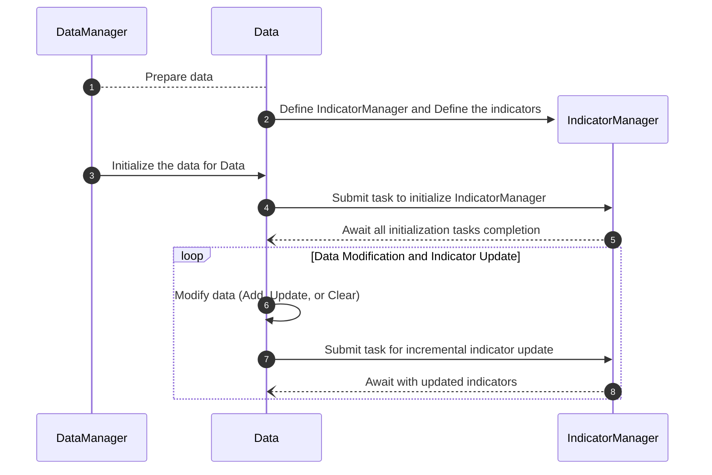

# 使用指南 

欢迎来到 **ΣTA** 使用指南！本指南将详细介绍 **ΣTA** 的核心功能及其使用方法，帮助您高效地管理数据与指标，适配多种实时交易与量化分析场景。

## 功能概览 

**ΣTA** 是一个高性能的数据与指标管理框架，专为金融量化领域设计，提供以下核心功能：

- **指标管理**：通过 `IndicatorManager` 动态管理金融指标，支持指标的添加、删除及复杂的多级依赖关系，确保计算逻辑的高度可扩展性和灵活性。
- **数据管理**：借助 `Indicator` 实现的高性能子类，对指标数据进行高效存储与管理，支持大规模数据的增量更新与优化访问。
- **增量计算**：实时响应数据变动，自动触发相关指标的增量计算，确保结果的高准确性与低延迟。
- **任务调度**：基于线程池的并行计算框架，有效调度多个指标的计算任务，提升系统整体性能与处理效率。
- **异步支持**：全面适配高并发场景，通过异步机制满足实时交易和动态计算需求，保障系统的高效稳定运行。

!!! note "适用场景"
	 **ΣTA** 适用于量化回测、实时交易、多指标依赖分析等高性能场景。

-----

## 指标管理

**描述**： `IndicatorManager` 是 ΣTA 框架的核心组件之一，专为管理金融指标的生命周期设计。它支持动态添加、删除和更新指标，并能够高效处理复杂的多指标依赖场景，确保计算的顺序性与结果的准确性。
??? note "`Data` 与  `IndicatorManager`  之间的关系"
	IndicatorManager 的初始化依赖于 Data 实例，其内部通过与 Data 实例中的回调函数绑定来实现数据的实时同步。这种设计确保了指标计算的实时性和准确性，适用于需要高频数据处理和实时分析的应用场景。
    ```mermaid
    classDiagram
        %% IndicatorManager 类
        class IndicatorManager {
            +names : List~str~
            +indicators : List~Indicator~
            +root_indicators : List~Indicator~
            +dependent_indicators : List~Indicator~
            +dict : Dict~str, Indicator~
            +status : List~dict~
            -_data : Data
            -_lock : threading.RLock
            -_executor : concurrent.futures.Executor
            -_root_indicators : List~Indicator~
            -_dependent_indicators : List~Indicator~
            -_indicators_dict : Dict~str, Indicator~
            -_root_indicators_futures : List~Future~
            -_dependent_indicators_futures : List~Future~
            +__init__()
            +add_indicator()
            +remove_indicator()
            +get_indicator()
            +I()
            +synchronize()
            +synchronize_async()
            -_register_dependent_future()
            -_on_data_changed()
            -_safe_execute()
        }
        %% Data 类
        class Data {
            +columns : List~str~
            +capacity : int
            +delete_size : int
            +size : int
            +timestamp : np.ndarray
            +open : np.ndarray
            +high : np.ndarray
            +low : np.ndarray
            +close : np.ndarray
            +volume : np.ndarray
            +np : np.ndarray
            +df : pd.DataFrame
            -_lock : RLock
            -_executor : Executor
            -_callbacks_sync : List~Callable~
            -_callbacks : List~Callable~
            -_callback_futures : List~Future~
            +__init__()
            +init()
            +add()
            +update()
            +remove()
            +clear()
            +register_callback_sync()
            +unregister_callback_sync()
            +register_callback()
            +unregister_callback()
            +wait_for_callbacks()
            +wait_for_callbacks_async()
            -_notify_callbacks_sync()
            -_notify_callbacks()
            -_process_input_data()
            -_ensure_capacity()
            -_initialize_data()
        }
        %% 关系
        IndicatorManager --> Data : "Depends on (_data)"
        Data --> IndicatorManager : "Registers callbacks"
    ```

??? example "初始化 `IndicatorManager` 示例" 
	`IndicatorManager` 的初始化依赖于 `Data` 实例：

    ```python
    from sigmata.indicators import SMA, EMA
    from sigmata.indicator_manager import IndicatorManager
    from sigmadata import Data
    
    data = Data(capacity=10000, delete_size=1000)
    
    # 通过 data 参数，将 Data 实例与 IndicatorManager 进行绑定，实现数据的实时同步
    manager = IndicatorManager(data=data)
    ```

### 1. 手动管理

**描述**： 手动管理允许用户通过明确调用方法来向  `IndicatorManager`  中添加、删除和获取指标。这种方式提供了对指标操作的完全控制，适用于需要精细化管理的场景。

#### 功能说明

- **添加指标**：通过 `add_indicator` 方法，支持单个独立指标的添加或基于依赖关系的添加。
- **删除指标**：通过 `remove_indicator` 方法移除已管理的指标。
- **获取指标**：通过 `get_indicator` 方法按名称检索已注册的指标。

#### 示例代码

```python
# 手动添加独立指标
sma = SMA(name="SMA_50", timeperiod=10)
manager.add_indicator(sma)

# 手动添加依赖指标
ema = EMA(name="EMA_20", timeperiod=10, pre_process=lambda x: x)
manager.add_indicator(ema, dependent=sma)

# 获取指标
sma_50 = manager.get_indicator("SMA_50")

# 删除指标
manager.remove_indicator(sma_50)
```

------

### 2. 自动管理

**描述**：通过 `I` 方法，自动创建、注册和管理指标实例。此方法适合需要快速定义和初始化多个指标的场景。

#### 功能说明

- **动态创建**：指定指标类名称和参数，自动完成实例化和注册。
- **依赖处理**：支持自动为新指标添加依赖关系。

!!! note "选择什么样的指标管理方式？"
	**推荐使用自动管理方式。** 自动管理方式不仅能够快速高效地完成指标的创建与注册，还能自动处理复杂的依赖关系，确保指标的正确性和安全性。如果需要手动精细化管理或对指标的依赖逻辑有严格控制的需求，可以选择手动管理方式。但需要注意，手动管理方式可能更繁琐，且未来可能被归类为高级保留选项，建议在大多数情况下优先采用自动管理。

#### 示例代码

```python
# 自动创建和注册独立指标
sma = manager.I(name="SMA_50", class_name=SMA, timeperiod=50)

# 自动创建并注册依赖指标
ema = manager.I(name="EMA_20", class_name=EMA, dependent=sma, timeperiod=20, pre_process=lambda x: x)

# 获取指标
sma_50 = manager.get_indicator("SMA_50")

# 删除指标
manager.remove_indicator(sma_50)
```

------

### 3. 计算同步

**描述**：计算同步功能通过 `synchronize` 方法实现，用于等待所有指标计算任务完成，确保数据和指标的更新状态一致。

#### 功能说明

- **同步等待**：使用 `synchronize` 方法阻塞主线程，等待所有计算任务完成。
- **异步等待**：通过 `synchronize_async` 方法实现非阻塞等待。

#### 示例代码

```python
# 同步等待
manager.synchronize()

# 异步等待（需要在异步环境中使用）
await manager.synchronize_async()
```

------

### 4. 状态查询

**描述**： `IndicatorManager` 提供丰富的状态查询方法，允许用户获取指标的全局状态或单个指标的详细信息。

#### 功能说明

- **全局状态查询**：通过 `status` 属性获取所有已管理指标的状态信息，包括名称、数据量、容量、依赖关系、子指标列表及初始化状态。
- **指标名称查询**：通过 `names` 属性获取所有已注册指标的名称列表。
- **指标实例查询**：通过 `indicators` 属性获取所有已注册的指标实例。
- **独立指标查询**：通过 `root_indicators` 属性获取所有不依赖其他指标的独立指标实例。
- **依赖指标查询**：通过 `dependent_indicators` 属性获取所有依赖其他指标的指标实例。
- **指标字典数据**：通过 `dict` 属性获取所有指标的名称与实例的映射关系。

#### 示例代码

```python
# 全局状态查询
for status in manager.status:
    print(f"名称: {status['name']}, 数据量: {status['size']}, 依赖: {[d._name for d in status['dependencies']]}")

# 查询所有指标名称
print("已注册指标名称:", manager.names)

# 获取所有指标实例
all_indicators = manager.indicators
for indicator in all_indicators:
    print(f"指标名称: {indicator._name}")

# 查询独立指标
root_indicators = manager.root_indicators
print("独立指标:")
for indicator in root_indicators:
    print(f"名称: {indicator._name}, 容量: {indicator._capacity}")

# 查询依赖指标
dependent_indicators = manager.dependent_indicators
print("依赖指标:")
for indicator in dependent_indicators:
    print(f"名称: {indicator._name}, 依赖: {[dep._name for dep in indicator._dependencies]}")

# 获取指标字典
indicators_dict = manager.dict
print("指标字典:")
for name, instance in indicators_dict.items():
    print(f"{name}: {instance}")

```

??? note "status 返回值示例"
    返回值参数解释：

    - name: 指标的名称，用于标识具体指标实例。
    - size: 当前指标中存储的数据条数，反映存储的实际内容量。
    - capacity: 指标实例的存储容量上限，表示可以存储的最大数据条数。
    - dependencies: 该指标所依赖的其他指标的名称，列表形式。
    - sub_indicators: 子指标列表，指与该指标关联的其他指标。
    - initialized: 指标是否完成初始化，true 表示已初始化，false 表示未初始化。
    
    ```json
    [
        {
            "name": "SMA_50",
            "size": 150,
            "capacity": 1000,
            "dependencies": [], 
            "sub_indicators": ["EMA_20"],
            "initialized": True
        },
        ...
        {
            "name": "RSI_14",
            "size": 0,
            "capacity": 1000,
            "dependencies": ["EMA_20"], 
            "sub_indicators": [],
            "initialized": False
        }
    ]
    ```

------

## 创建指标

**描述**：指标库中的指标类通过 `Indicator` 实现的高性能子类设计，专为金融指标数据的存储与动态管理优化。它结合 `Indicator` 的灵活性和 NumPy 的高效性，提供实时计算与增量更新能力，是 ΣTA 系统的核心组件。

### 如何使用指标库

#### 示例代码

```python
import numpy as np
from sigmata.indicators import SMA

# 初始化SMA指标，设置时间周期为5
sma = SMA(name="SMA_5", timeperiod=5)

# 模拟输入数据（假设为收盘价）
input_data = np.array([

# 初始化指标
sma.init(data=input_data, timestamps=np.arange(len(input_data)))

# 输出计算结果
print(sma.values)
# 输出:
# [      nan       nan       nan       nan       nan       nan       nan
#        nan       nan 61876.5 61920.127273 61942.356536 61989.084516]

```


### 如何自定义指标


##### 示例代码

```python

```

##### 完整的创建 SMA 指标示例

```python
from typing import Callable, Dict, List, Optional
import numpy as np
from numba import njit
from sigmata.indicators import Indicator


@njit(nogil=True)
def compute_sma_init(
    output_array: np.ndarray, input_data: np.ndarray, index: int, timeperiod: int
) -> None:
    """
    计算初始的简单移动平均线（SMA）值，直到指定的索引位置。
    
    该函数遍历输入数据，维护当前窗口的累积和和有效（非NaN）数据点的计数。
    如果窗口内有足够的有效数据点，则计算SMA，否则将对应位置设为NaN。
    
    参数:
    ----------
    output_array : np.ndarray
        用于存储计算结果的数组，应预先用NaN填充。
    input_data : np.ndarray
        输入数据数组（例如收盘价），可以包含NaN值。
    index : int
        当前计算的索引位置。
    timeperiod : int
        移动窗口的时间周期（窗口大小）。
    """
    cumsum = 0.0  # 当前窗口的累积和
    count = 0  # 当前窗口内有效（非NaN）数据点的数量

    for i in range(index):
        # 如果当前数据点不是NaN，则加入累积和并增加计数
        if not np.isnan(input_data[i]):
            cumsum += input_data[i]
            count += 1

        # 如果窗口超过了时间周期，则减去滑出窗口的值
        if i >= timeperiod:
            if not np.isnan(input_data[i - timeperiod]):
                cumsum -= input_data[i - timeperiod]
                count -= 1

        # 如果当前窗口内有足够的有效数据点，则计算SMA
        if count == timeperiod:
            output_array[i] = cumsum / timeperiod
        else:
            # 否则，将SMA设为NaN
            output_array[i] = np.nan


@njit(nogil=True)
def compute_sma_incremental(
    output_array: np.ndarray, input_data: np.ndarray, index: int, timeperiod: int
) -> None:
    """
    增量计算指定索引位置的简单移动平均线（SMA）值，适当处理NaN值。
    
    该函数根据当前索引位置是否有足够的数据点来决定是计算完整窗口的SMA还是部分窗口的SMA。
    如果窗口内包含NaN值或数据点不足，则将对应位置设为NaN。
    
    参数:
    ----------
    output_array : np.ndarray
        用于存储计算结果的数组，应预先用NaN填充。
    input_data : np.ndarray
        输入数据数组（例如收盘价），可以包含NaN值。
    index : int
        当前计算的索引位置。
    timeperiod : int
        移动窗口的时间周期（窗口大小）。
    """
    # 检查是否有足够的数据点来形成完整的窗口
    if index >= timeperiod - 1:
        cumsum = 0.0
        valid = True
        start = index - timeperiod + 1
        for i in range(start, index + 1):
            value = input_data[i]
            if np.isnan(value):
                valid = False
                break
            cumsum += value
        if valid:
            output_array[index] = cumsum / timeperiod
        else:
            output_array[index] = np.nan
    else:
        # 对于窗口未完全形成的索引位置
        cumsum = 0.0
        valid = True
        for i in range(index + 1):
            value = input_data[i]
            if np.isnan(value):
                valid = False
                break
            cumsum += value
        if valid and index >= 0:
            output_array[index] = cumsum / (index + 1)
        else:
            output_array[index] = np.nan


class SMA(Indicator):
    """
    简单移动平均线（SMA）指标类。
    
    该类封装了在指定窗口大小上计算SMA的逻辑，支持初始化计算和增量更新。
    """

    def __init__(
        self,
        name: str,
        timeperiod: int,
        capacity: int = 20000,
        delete_size: int = 100,
        pre_process: Optional[Callable[[np.ndarray], np.ndarray]] = None,
        post_process: Optional[Callable[[np.ndarray], np.ndarray]] = None,
    ):
        """
        初始化SMA指标。
        
        参数:
        ----------
        name : str
            指标的名称。
        timeperiod : int
            计算SMA的移动窗口大小（时间周期）。
        capacity : int, 可选
            内部缓冲区中存储的最大SMA值数量，默认值为20000。
        delete_size : int, 可选
            当缓冲区达到容量时，移除的最旧SMA值数量，默认值为100。
        pre_process : Optional[Callable[[np.ndarray], np.ndarray]], 可选
            在SMA计算前对输入数据进行预处理的函数，默认为None。
        post_process : Optional[Callable[[np.ndarray], np.ndarray]], 可选
            在SMA计算后对结果进行后处理的函数，默认为None。
        """
        super().__init__(
            name=name,
            capacity=capacity,
            delete_size=delete_size,
            pre_process=pre_process,
            post_process=post_process,
        )

        # 初始化存储SMA值的数组，并填充为NaN
        self._values = np.empty(self._capacity, dtype=np.float64)
        self._values[:] = np.nan

        self.timeperiod = timeperiod  # 设置移动窗口大小

    @staticmethod
    def _default_pre_process(input_data: np.ndarray) -> np.ndarray:
        """
        默认的预处理方法，从输入数据中提取收盘价。
        
        假设收盘价位于输入数据的第5列（索引为4）。
        
        参数:
        ----------
        input_data : np.ndarray
            输入数据数组，通常包含OHLCV（开盘价、最高价、最低价、收盘价、成交量）数据。
        
        返回:
        -------
        np.ndarray
            提取的收盘价数组。
        """
        return input_data[:, 4]

    @staticmethod
    def _default_post_process(output_array: np.ndarray) -> np.ndarray:
        """
        默认的后处理方法，对SMA值不进行任何修改，直接返回原值。
        
        参数:
        ----------
        output_array : np.ndarray
            包含计算结果的SMA值数组。
        
        返回:
        -------
        np.ndarray
            处理后的SMA值数组。
        """
        return output_array

    def _compute_init_func(
        self, output_array: np.ndarray, input_data: np.ndarray, index: int
    ) -> None:
        """
        计算初始的SMA值，直到指定的索引位置，并将结果存储在output_array中。
        
        该方法首先对输入数据进行预处理，然后调用compute_sma_init函数进行初始SMA计算，
        最后应用后处理函数对结果进行处理。
        
        参数:
        ----------
        output_array : np.ndarray
            用于存储计算结果的数组。
        input_data : np.ndarray
            输入数据数组，通常包含OHLCV数据。
        index : int
            计算的索引位置。
        """
        input_data_close = self._pre_process(input_data)  # 预处理，提取收盘价
        compute_sma_init(output_array, input_data_close, index, self.timeperiod)  # 计算初始SMA
        output_array[:] = self._post_process(output_array)  # 应用后处理

    def _compute_incremental_func(
        self, output_array: np.ndarray, input_data: np.ndarray, index: int
    ) -> None:
        """
        增量计算指定索引位置的SMA值，并更新output_array。
        
        该方法首先对输入数据进行预处理，然后调用compute_sma_incremental函数进行增量计算，
        最后应用后处理函数对最新的SMA值进行处理。
        
        参数:
        ----------
        output_array : np.ndarray
            用于存储计算结果的数组。
        input_data : np.ndarray
            输入数据数组，通常包含OHLCV数据。
        index : int
            当前计算的索引位置。
        """
        input_data_close = self._pre_process(input_data)  # 预处理，提取收盘价
        compute_sma_incremental(output_array, input_data_close, index, self.timeperiod)  # 增量计算SMA
        output_array[index] = self._post_process(output_array)[index]  # 应用后处理

    @property
    def dict(self) -> Dict[str, List[float]]:
        """
        以字典格式返回计算的SMA值。
        
        字典的键为指标名称，值为SMA值的列表。
        
        返回:
        -------
        Dict[str, List[float]]
            包含SMA值的字典，键为指标的名称。
        """
        return {self._name: self.values.tolist()}

```


------

## 增量计算

**描述**：增量计算模块通过指标与数据的联动实现，数据发生变化时，自动触发相关指标的增量更新，适用于实时交易与动态分析场景。

#### 功能说明

- **自动触发**：数据更新、添加、删除时，自动触发关联指标的重新计算。
- **依赖传播**：支持多指标间的依赖关系，确保更新顺序的正确性。
- **高效计算**：仅计算受影响的部分数据，提升性能。

#### 示例代码

```python

```

-----

## 任务调度

**描述**：任务调度模块通过线程池管理所有指标计算任务，确保多任务并行执行的高效性。

#### 功能说明

- **线程池支持**：基于共享线程池调度任务，实现任务的并行化。
- **自动任务管理**：数据操作后，自动提交计算任务到线程池。
- **同步与异步等待**：支持同步和异步方式等待任务完成。

#### 示例代码

```python

```





??? note "详细序列图展示"
    ```mermaid
    sequenceDiagram
      autonumber
      DataManager->>DataManager: Load OHLCV Data
      DataManager-->Data: Prepare data
      create participant IndicatorManager
      Data->>IndicatorManager: Define IndicatorManager
      create participant Indicator
      IndicatorManager->>Indicator: Define the indicators
      DataManager->>Data: Initialize the data for Data
      Data->>GlobalThreadPool: Submit task to initialize IndicatorManager
      GlobalThreadPool-->>IndicatorManager: Submit initialization tasks to IndicatorManager
      IndicatorManager->>GlobalThreadPool: Submit tasks to initialize individual indicators
      par Initialize Indicator 1
          GlobalThreadPool-->>Indicator: Initialize Indicator 1
      and Initialize Indicator 2
          GlobalThreadPool-->>Indicator: Initialize Indicator 2
      and Initialize Indicator N
          GlobalThreadPool-->>Indicator: Initialize Indicator N
      end
      GlobalThreadPool--)IndicatorManager: Await all indicator initialization completion
      GlobalThreadPool--)Data: Await all initialization tasks completion
      loop Data Modification and Indicator Update
          Data->>Data: Modify data (Add, Update, or Clear)
          Data->>GlobalThreadPool: Submit task for incremental indicator update
          GlobalThreadPool-->>IndicatorManager: Submit incremental update tasks to IndicatorManage
          IndicatorManager->>GlobalThreadPool: Submit tasks to update individual indicators
          par Update Indicator 1
              GlobalThreadPool-->>Indicator: Update Indicator 1
          and Update Indicator 2
              GlobalThreadPool-->>Indicator: Update Indicator 2
          and Update Indicator N
              GlobalThreadPool-->>Indicator: Update Indicator N
          end
          GlobalThreadPool--)IndicatorManager: Await all updates completion
          GlobalThreadPool--)Data: Await with updated indicators
      end
    ```


