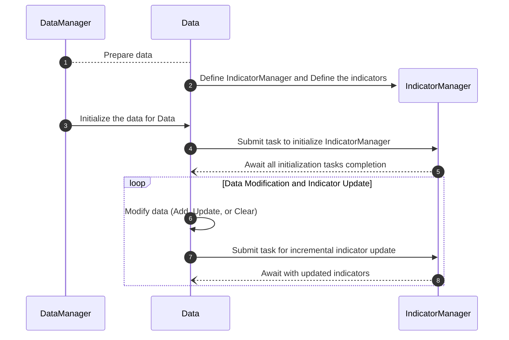

# 📘 使用指南 

欢迎来到 **ΣTA** 使用指南！本指南将详细介绍 **ΣTA** 的核心功能，包括如何

## 🌟 功能概览 

**ΣTA** 提供以下核心功能，：

- 

!!! note "适用场景"
	 **ΣTA** 适用于实时交易





??? note "详细的图表展示"
    ```mermaid
    sequenceDiagram
      autonumber
      DataManager->>DataManager: Load OHLCV Data
      DataManager-->Data: Prepare data
      create participant IndicatorManager
      Data->>IndicatorManager: Define IndicatorManager
      create participant Indicator
      IndicatorManager->>Indicator: Define the indicators
      DataManager->>Data: Initialize the data for Data
      Data->>GlobalThreadPool: Submit task to initialize IndicatorManager
      GlobalThreadPool-->>IndicatorManager: Submit initialization tasks to IndicatorManager
      IndicatorManager->>GlobalThreadPool: Submit tasks to initialize individual indicators
      par Initialize Indicator 1
          GlobalThreadPool-->>Indicator: Initialize Indicator 1
      and Initialize Indicator 2
          GlobalThreadPool-->>Indicator: Initialize Indicator 2
      and Initialize Indicator N
          GlobalThreadPool-->>Indicator: Initialize Indicator N
      end
      GlobalThreadPool--)IndicatorManager: Await all indicator initialization completion
      GlobalThreadPool--)Data: Await all initialization tasks completion
      loop Data Modification and Indicator Update
          Data->>Data: Modify data (Add, Update, or Clear)
          Data->>GlobalThreadPool: Submit task for incremental indicator update
          GlobalThreadPool-->>IndicatorManager: Submit incremental update tasks to IndicatorManage
          IndicatorManager->>GlobalThreadPool: Submit tasks to update individual indicators
          par Update Indicator 1
              GlobalThreadPool-->>Indicator: Update Indicator 1
          and Update Indicator 2
              GlobalThreadPool-->>Indicator: Update Indicator 2
          and Update Indicator N
              GlobalThreadPool-->>Indicator: Update Indicator N
          end
          GlobalThreadPool--)IndicatorManager: Await all updates completion
          GlobalThreadPool--)Data: Await with updated indicators
      end
    ```


