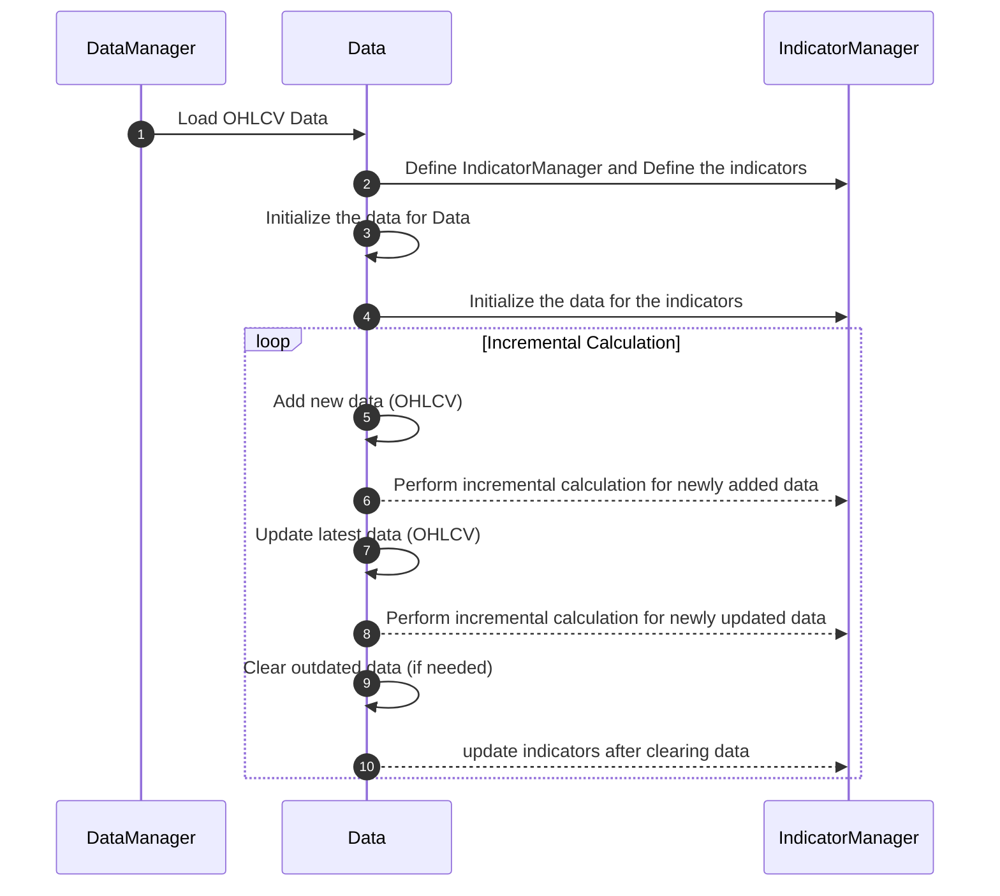
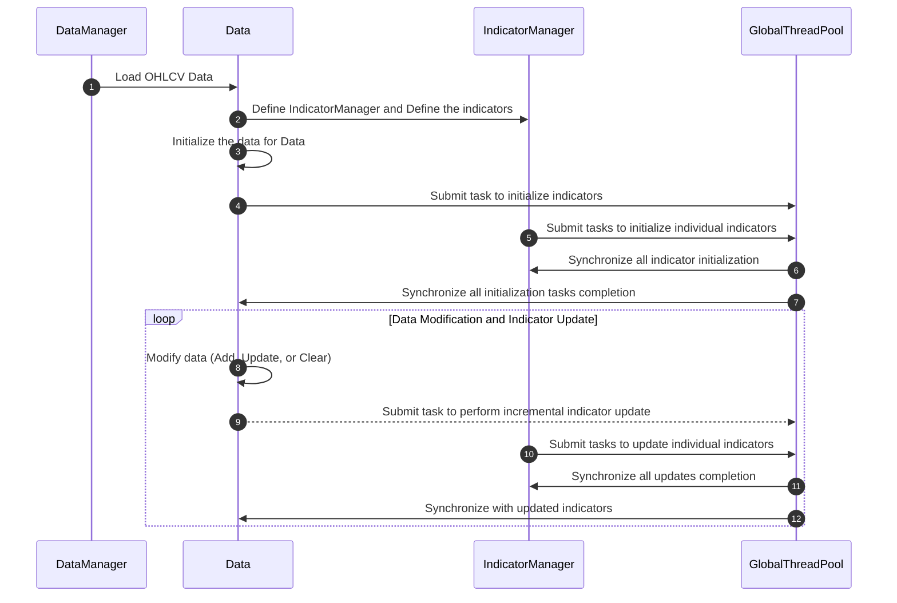
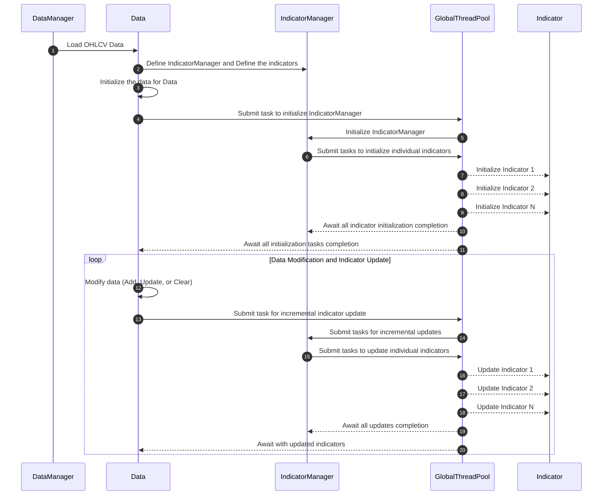

``` mermaid
sequenceDiagram
  autonumber
  DataManager->>Data: Load OHLCV Data
  Data->>IndicatorManager: Define IndicatorManager and Define the indicators
  Data->>Data: Initialize the data for Data
  Data->>IndicatorManager: Initialize the data for the indicators
  
  loop Incremental Calculation
      Data->>Data: Add new data (OHLCV)
      Data-->>IndicatorManager: Perform incremental calculation for newly added data
      Data->>Data: Update latest data (OHLCV)
      Data-->>IndicatorManager: Perform incremental calculation for newly updated data
      Data->>Data: Clear outdated data (if needed)
      Data-->>IndicatorManager: update indicators after clearing data
  end

```

```mermaid
sequenceDiagram
  autonumber
  DataManager->>Data: Load OHLCV Data
  Data->>IndicatorManager: Define IndicatorManager and Define the indicators
  Data->>Data: Initialize the data for Data
  Data->>GlobalThreadPool: Submit task to initialize indicators
  IndicatorManager->>GlobalThreadPool: Submit tasks to initialize individual indicators
  GlobalThreadPool->>IndicatorManager: Synchronize all indicator initialization
  GlobalThreadPool->>Data: Synchronize all initialization tasks completion
  
  loop Data Modification and Indicator Update
      Data->>Data: Modify data (Add, Update, or Clear)
      Data-->>GlobalThreadPool: Submit task to perform incremental indicator update
      IndicatorManager->>GlobalThreadPool: Submit tasks to update individual indicators
      GlobalThreadPool->>IndicatorManager: Synchronize all updates completion
      GlobalThreadPool->>Data: Synchronize with updated indicators
  end

```

```mermaid
sequenceDiagram
  autonumber
  DataManager->>Data: Load OHLCV Data
  Data->>IndicatorManager: Define IndicatorManager and Define the indicators
  Data->>Data: Initialize the data for Data
  Data->>GlobalThreadPool: Submit task to initialize IndicatorManager
  GlobalThreadPool->>IndicatorManager: Initialize IndicatorManager
  IndicatorManager->>GlobalThreadPool: Submit tasks to initialize individual indicators
  GlobalThreadPool-->>Indicator: Initialize Indicator 1
  GlobalThreadPool-->>Indicator: Initialize Indicator 2
  GlobalThreadPool-->>Indicator: Initialize Indicator N
  GlobalThreadPool-->>IndicatorManager: Await all indicator initialization completion
  GlobalThreadPool-->>Data: Await all initialization tasks completion
  
  loop Data Modification and Indicator Update
      Data->>Data: Modify data (Add, Update, or Clear)
      Data->>GlobalThreadPool: Submit task for incremental indicator update
      GlobalThreadPool->>IndicatorManager: Submit tasks for incremental updates
      IndicatorManager->>GlobalThreadPool: Submit tasks to update individual indicators
      GlobalThreadPool-->>Indicator: Update Indicator 1
      GlobalThreadPool-->>Indicator: Update Indicator 2
      GlobalThreadPool-->>Indicator: Update Indicator N
      GlobalThreadPool-->>IndicatorManager: Await all updates completion
      GlobalThreadPool-->>Data: Await with updated indicators
  end

```

